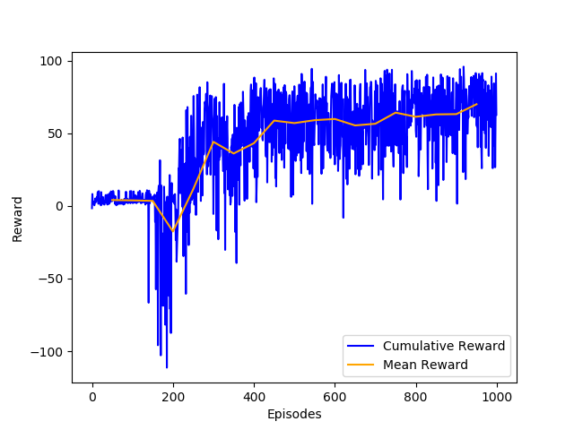

# Multi-robot Target Tracking

---

### Authors
Arpit Aggarwal
Lifeng Zhou

### Introduction to the Project
Robot-target tracking is the task of localizing the targets by using mobile robots. The task is to determine an optimal robot trajectory to minimize the uncertainty in the targets position. First, the task was comparing the Extended Kalman Filter(EKF) and Bayesian Histogram(BH) techniques for creating a heatmap of the environment, where the bright region denoted the total uncertainty in the targets position. Next, the task was using RL technique to determine the optimal action to be taken by the robot to minimize the total uncertainty in the heatmap.

### Results

Actor-Critic Model Evaluation (robots=1, targets=1)
 

Actor-Critic Model Training (robots=1, targets=1)
 

### Software Required
To run the .py files, use Python 3. Standard Python 3 libraries like OpenAI Gym, PyTorch, Numpy, and matplotlib are used.

### Credits
The following links were helpful for this project:
1. https://github.com/ksengin/active-target-localization/
2. https://ksengin.github.io/active-target-localization/
